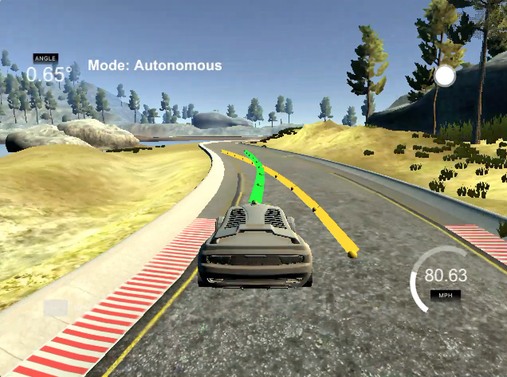

# Model Predictive Control Project
**Udacity Self-Driving Car Engineer Nanodegree Program**

The goal of the project is to implement a Model Predictive Controller in c++ which can drive a simulated vehicle around a simulated track. The simulator will provide the controller with waypoints of the track and current state of the vehicle. The controller needs to set the appropriate steering angle and acceleration for the vehicle.

## Implementation Notes

### Model Predictive Controller

At each iteration of the the control loop the algorithm predicts the trajectory of the vehicle for a few time steps in the future. By tweaking the actuations at each time step the trajectory is modified to minimise the following objectives:
- Minimise the distance to the desired trajectory
- Minimise the use of actuators to reduce erratic driving behaviour
- Minimise the difference between sequential actuations so that the drive is more smooth.

This optimisation task is setup as a linear optimisation problem and thus can be solved using the c++ library ipopt in real time. After the optimised actuations are obtained, only the first set of actuation is executed.

### vehicle model

The vehicle is modelled with the following parameters:
 - x, y: the location.
 - psi: the heading.
 - v: the velocity.
 - cte: the cross track error. i.e. a measure of how far away is the vehicle to the desired trajectory.
 - espi: the difference between the current heading and desired heading.

The the vehicle is actuated by 2 inputs:
- delta: The angle of steering. It is limited to 25 degrees on either side. This is mapped to [-1 1] in the simulator.
- a: The acceleration. It is proportional to the amount of throttle of the vehicle. It is limited to [-3.6, 3.6] m/s^2 with negative being breaking. This value was chosen because in the simulator the throttle limit is [-1, 1] and at full throttle, the vehicle took ~7.5s to reach 60mph which works out to be 3.6 m/s^2 of acceleration.

At each time step these parameters are predicted using a bicycle dynamic model. The equations are as follows:
- `x_[t+1] = x[t] + v[t] * cos(psi[t]) * dt`
- `y_[t+1] = y[t] + v[t] * sin(psi[t]) * dt`
- `psi_[t+1] = psi[t] + v[t] / Lf * delta[t] * dt`
- `v_[t+1] = v[t] + a[t] * dt`
- `cte[t+1] = f(x[t]) - y[t] + v[t] * sin(epsi[t]) * dt`
- `epsi[t+1] = psi[t] - psides[t] + v[t] * delta[t] / Lf * dt`

Where `dt` is the time between each update, `f(x)` is the y value of the desired trajectory at position x. `psides` is the desired heading. The update loop is implemented in c++ [here](src/MPC.cpp#L125-L130).

### Choosing N (number of timesteps) and dt (elapsed duration between timesteps)

In the algorithm described above there is a choice to be made about how long do we predict into the future and how many times during that time period should the model be evaluated. It is a trade off between the following constraints:
- Because we are running the controller in real time, it cannot take too long meaning the number of variables, and hence time steps, are limited.
- At the same time, the smaller the elapsed duration, dt, the more accurate the model, leading to a more accurate controller.
- We also want to predict far enough into the future so that the controller can deal with up-coming features of the road.

I started off with predicting 2s into the future. At low speeds (~30mph) the model predicts 25 meters ahead of the car, this covers enough of the bends on the track that the MPC can optimise correctly. I set the number of timesteps to 10, this gives 70 parameters to optimise. On my laptop, the optimiser takes on average ~0.03s to run which allows a healthy 33hz maximum control frequency.

When I tried to increase the vehicle speed, the prediction points become very few and far between. This means the car was not able to follow the desired trajectory very well. Hence I reduced the prediction time to 0.5s with 10 time steps giving a dt of 0.05s. [Code here](src/MPC.cpp#L14-L17).

### Processing way points

The simulator passes a set of way points to the controller in **global coordinates**. Later the way points trajectory and mpc projected trajectory need to be returned to the simulator for display in vehicle coordinates. Hence a [2d rigid body transformation](src/main.cpp#L86-L113) need to be applied to the points.

I chose to [transform the points](src/main.cpp#L163) before passing them to the optimiser such that the optimisation happens in vehicle coordinates and the projected trajectory come out in vehicle coordinates saving the need for further transformation.

### Controller latency

There is a 100ms delay built into the controller to simulate control delays in a real world. To deal with this delay, the state of the vehicle is projected into the future to the time point where the actuation is expected to take place. This is done as a [first step](src/main.cpp#L145-L158) after receiving the vehicle state such that the rest of the system does not have to care about the latency.

However as the projection uses the same vehicle model used in the MPC, it is not very accurate. Hence the system have a tendency to oscillate. To dampen the oscillation, the use of actuation is discouraged by a large [weight](src/MPC.cpp#L64) in the objective function.

The latency also has an impact on the display of trajectories in the simulator. As the trajectory will be plotted 100ms later in vehicle coordinate, and the vehicle coordinates are only estimated, the trajectories some times appear to be in the wrong places. This is most severe when the steering angles are large as in the above image.

## Result

This [videos](https://youtu.be/GGUX7dLvlYs) shows that the vehicle is able to go around the track safely at speeds exceeding 80 mph. This is significantly better than the [PID controller](https://youtu.be/efuUPviqgTo) which only achieved around 50 mph. More notably the drive was significantly more stable with MPC and did not need to slow down for corners.
